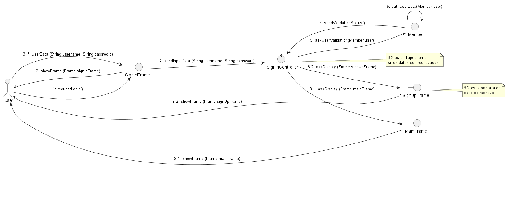
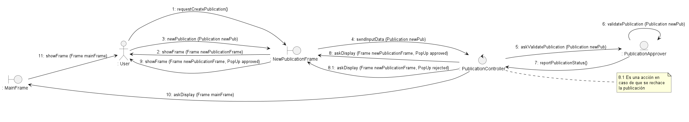
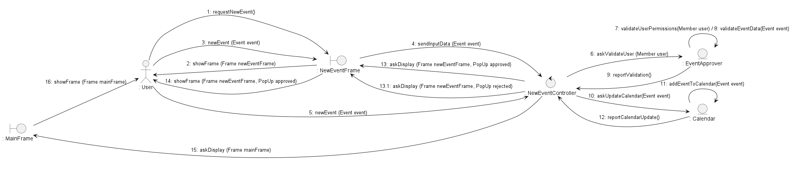

# ProyectoFacUpdate Ingenieria de Software
Este Repositorio contiene los diagramas y Source Code para el proyecto de red social FacUpdate

##INTEGRANTES EQUIPO 2:
| Cédula    | Nombres         | Apellidos        |
|-----------|-----------------|------------------|
| 32412330  | Gabriel David   | Conde Núñez      |
| 28314837  | Daniel          | Flores Carrasco  |
| 30730601  | Josué David     | Guedez López     |
| 30520730  | Mariangel       | Gómez Hernández  |
| 30821017  | Sabrina         | Herrera Martínez |
| 31080238  | Carlos Alejandro| Miranda Brito    |

## MODELO DEL DOMINIO
  
### Diagrama de Clases

### Diagrama de Estado!
[dmStateDiagram](https://github.com/user-attachments/assets/d2c11982-3be7-417f-b64c-6cee1084bb29)

## MODELO DE CASOS DE USO

### Diagrma de Casos de Uso

### Diagrama de Estados

### VisionBoard
[FacUpdate - VisionBoard](../../Users/danfl/Downloads/Team2_VisionBoard.pptx)

### ESQUEMA DE PANTALLAS

[URL FIGMA: https://www.figma.com/design/TRyo6UMPosKdJIfEJnekTG/Esquema-de-Pantallas-FacUpdate?node-id=0-1&t=pNRDqKXMZxMyGxf3-1]

## MODELO DE ANÁLISIS

### DIAGRAMA DE PAQUETES

### DIAGRAMA DE CLASES

### DIAGRAMAS POR CASOS DE USO PRIORITARIO

#### DIAGRAMA DE CLASES
 
##### UC1-Sign Up
 

##### UC2-LogIn

##### UC3-CreatePublication
 

##### UC5-Create Event

#### DIAGRAMA DE COLABORACION

##### UC1-Sign Up

##### UC2-LogIn

##### UC3-Create Publication

##### UC5-Create Event
 
 
 
